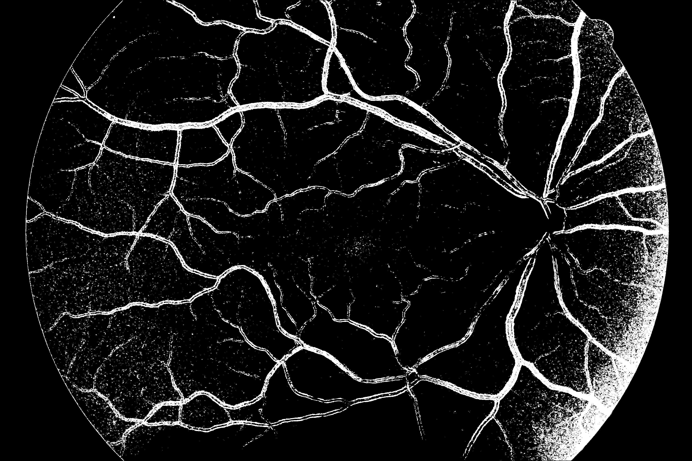

# Fundus Retinal Vessel Segmentation

This project contains detailed analysis and comparison of 3 different methods for solving problem of fundus retinal vessel segmentation. It was made as final project for the 6-th semester _Computer Science in Medicine_ subject course at Poznan University of Technology. 

All code was merged as part of report in `eye_fundus.ipynb`. Inside 3 methods of approaching this problem are outlined:
- `rf` - _Ridge Filtering_ - Using CV image-related functions and ridge filters 
- `ml` - _Machine Learning_ - Using well-established machine learning classifiers for image chunks
- `dl` - _Deep Learning_ - Using Deep Neural Network with U-net architecture 

References: 

- Liskowski, Krawiec 2016 - [Segmenting Retinal Blood Vessels With Deep Neural Networks](https://pubmed.ncbi.nlm.nih.gov/27046869/)
- HRF Dataset - https://www5.cs.fau.de/research/data/fundus-images/